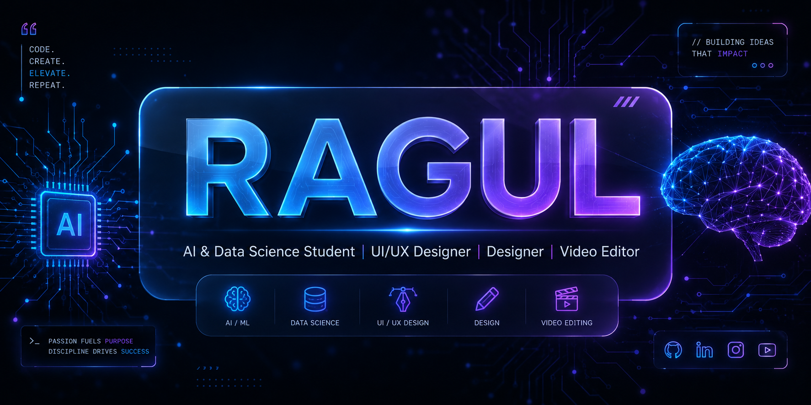

<p align="center">
  
</p>

# 👋 Hi, I'm Ragul

### 🤖 AI & Data Science Student | 🎨 UI/UX Designer | ✨ Designer | 🎬 Video Editor


</div>

---

# 💫 About Me

🎓 I'm currently pursuing **B.Tech in Artificial Intelligence & Data Science**.

🎨 Passionate about designing beautiful and user-friendly digital experiences through **UI/UX Design**.

✨ I enjoy creating modern designs, branding, and creative visuals.

🎬 I also work as a **Video Editor**, creating engaging and high-quality content.

🚀 My goal is to combine **AI + Design** to build impactful products.

---

# 🌐 Connect With Me

<p align="center">

<a href="YOUR_LINKEDIN_URL">

</a>

<a href="mailto:YOUR_EMAIL">

</a>

</p>

---

# 💻 Tech Stack

<p align="center">
  
</p>
<p align="center">


<br><br>


</p>

---

# 🚀 Current Projects

✨ AI Research Paper Review System

📱 Travel Booking Mobile App UI/UX

🎓 Career Intelligence & Skill Gap Analysis System

🎨 Personal Portfolio Website

---

# 📊 GitHub Statistics

<p align="center">


</p>

---

# 📈 Most Used Languages

<p align="center">


</p>

---

# 📈 Contribution Graph

<p align="center">


</p>

---

# 🛠️ Tools I Use

<p align="center">


</p>

---

# 🏆 GitHub Trophies

<p align="center">


</p>

---

# ⚡ Fun Fact

```text
"Turning Ideas into Intelligent & Beautiful Digital Experiences."
```

---

<div align="center">

### ⭐ Thanks for visiting my profile!


</div>
